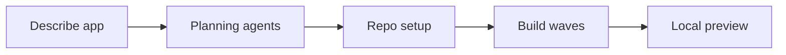

# Grelve

**Agent-native software execution** — describe an app in plain language, get planning artifacts, a scaffolded repo, parallel build agents, and a local preview.

Product and company information: **[grelve.com](https://grelve.com/)**  
Privacy · Terms: [Privacy Policy](https://grelve.com/privacy) · [Terms of Service](https://grelve.com/terms)

---

## What this repository is

This is the open-source **Grelve orchestrator**: a Next.js control UI and a FastAPI backend that run multi-agent workflows end to end. You stay in one chat surface while specialized agents write planning docs, scaffold a workspace, implement in waves, and hand off to preview.

The public site at [grelve.com](https://grelve.com/) describes the Grelve product experience (for example, sending a link to collect video or voice testimonials in the browser). **This repo is the engine** that plans and builds full-stack applications using a fixed stack and deterministic agent pipeline—not a hosted copy of the marketing site itself.

---

## End-to-end flow



| Phase | Where in the UI | What happens |
|-------|-----------------|--------------|
| **1. Planning** | `/` (home) | Six agents produce `docs/*.md` artifacts from your prompt. |
| **2. Repo setup** | Same run, step 06 | Repo Setup Agent scaffolds `frontend/` + `backend/` under an isolated workspace. |
| **3. Build** | `/build?runId=…` | Five waves of coding agents run in parallel per wave. |
| **4. Preview** | `/preview?runId=…` | Starts generated FastAPI + Next.js locally; optional env vars. |

Generated workspaces and logs live under `backend/.shipyard_runs/<run-id>/` (gitignored). Never commit that directory—it may contain secrets.

---

## Planning phase (six steps)

Each step streams tool activity into the UI and writes a markdown artifact.

| Step | Agent | Output |
|------|--------|--------|
| 01 Intake | Intake Agent | `docs/intake.md` |
| 02 Product Brief | Product Brief Agent | `docs/product_brief.md` |
| 03 System Design | System Design Agent | `docs/system_design.md` |
| 04 API Contract | API Contract Agent | `docs/api_contract.md` |
| 05 Task Breakdown | Task Breakdown Agent | `docs/task_breakdown.md` |
| 06 Repo Setup | Repo Setup Agent | Workspace scaffold + `docs/repo_setup_report.md` |

Agent behavior is defined in `backend/agent_skills/*.md`.

When planning finishes, click **Continue building** to open the build phase.

---

## Build phase (five waves)

Build agents share one workspace per run. Within each wave, agents run in parallel; waves run sequentially.

| Wave | Title | Agents |
|------|--------|--------|
| 1 | Foundation | Backend Data Agent, Frontend Shell Agent |
| 2 | Core Product | Backend API Agent, Frontend Feature Agent |
| 3 | API Connection | Frontend API Integration Agent |
| 4 | Integration | Integration Agent |
| 5 | Review | Review Agent |

The build UI (`/build`) shows per-agent todo lists, tool calls, diffs, and command output. When the run completes, continue to preview.

---

## Fixed stack

All generated apps target the same stack (enforced by agents):

| Layer | Technology |
|-------|------------|
| Frontend | Next.js, TypeScript, React |
| Backend | FastAPI |
| Database | SQLite |

Brand rules for generated UIs: white background, black text, primary accent `#E3F848`.

---

## Repository layout

```
.
├── README.md                 # This file
├── backend/
│   ├── main.py               # FastAPI app, agents, tools, SSE streams
│   ├── requirements.txt
│   ├── .env.example          # Copy to .env (not committed)
│   └── agent_skills/         # Prompts for each planning/build agent
└── frontend/
    ├── src/app/
    │   ├── page.tsx          # Planning chat + workflow UI
    │   ├── build/page.tsx    # Build wave dashboard
    │   └── preview/page.tsx  # Local preview launcher
    ├── .env.example          # Copy to .env.local (not committed)
    └── package.json
```

Internal API routes use the `/api/v1/shipyard/` prefix (historical codename for the orchestration runtime). User-facing branding is **Grelve**.

---

## Prerequisites

- **Node.js** 20+ and npm
- **Python** 3.11+
- **DeepSeek API key** (or compatible OpenAI-style provider via env vars)
- Disk space for generated workspaces under `backend/.shipyard_runs/`

---

## Install and run (local)

### 1. Clone and configure secrets

```bash
git clone <your-fork-url>
cd grelve   # or your clone directory name
```

**Backend**

```bash
cd backend
python3 -m venv .venv
source .venv/bin/activate   # Windows: .venv\Scripts\activate
pip install -r requirements.txt
cp .env.example .env
```

Edit `backend/.env` and set at minimum:

```env
DEEPSEEK_API_KEY=your_key_here
```

**Frontend**

```bash
cd ../frontend
npm install
cp .env.example .env.local
```

Default `frontend/.env.local`:

```env
NEXT_PUBLIC_API_URL=http://127.0.0.1:8000
```

### 2. Start the API

From `backend/` with the venv active:

```bash
uvicorn main:app --reload --host 127.0.0.1 --port 8000
```

- Health: [http://127.0.0.1:8000/api/v1/health](http://127.0.0.1:8000/api/v1/health)
- OpenAPI: [http://127.0.0.1:8000/docs](http://127.0.0.1:8000/docs)

### 3. Start the UI

From `frontend/`:

```bash
npm run dev
```

Open [http://localhost:3000](http://localhost:3000).

### 4. Run a full cycle

1. Enter a product prompt on the home page and submit.
2. Wait for all six planning/repo steps to complete.
3. Click **Continue building** → build waves stream on `/build`.
4. When build finishes, open **Continue** on the build page → `/preview`.
5. Add env vars if prompted, then start the local app preview.

---

## Environment variables

### Backend (`backend/.env`)

| Variable | Required | Description |
|----------|----------|-------------|
| `DEEPSEEK_API_KEY` | Yes* | LLM access for agents (default provider). |
| `SHIPYARD_LLM_API_KEY` | Alt | Override key for custom base URL. |
| `OPENAI_API_KEY` | Alt | If using OpenAI-compatible non-DeepSeek endpoint. |
| `SHIPYARD_LLM_BASE_URL` | No | Default `https://api.deepseek.com/v1` |
| `SHIPYARD_LLM_MODEL` | No | Default `deepseek-v4-pro` |
| `PROJECT_NAME` | No | API title in docs (default `Grelve API`) |
| `CORS_ORIGINS` | No | Comma-separated UI origins |
| `API_V1_PREFIX` | No | Default `/api/v1` |

\* Or equivalent keys for your chosen provider—see `backend/.env.example`.

### Frontend (`frontend/.env.local`)

| Variable | Required | Description |
|----------|----------|-------------|
| `NEXT_PUBLIC_API_URL` | No | FastAPI origin (default `http://127.0.0.1:8000`) |

**Never commit** `.env`, `.env.local`, or `backend/.shipyard_runs/`. Only `*.env.example` files belong in git.

---

## HTTP API (orchestrator)

| Method | Path | Purpose |
|--------|------|---------|
| `GET` | `/api/v1/health` | Liveness check |
| `POST` | `/api/v1/shipyard/runs` | Create run; may return SSE stream |
| `GET` | `/api/v1/shipyard/runs/{id}/stream` | Planning SSE stream |
| `GET` | `/api/v1/shipyard/runs/{id}/build-stream` | Build SSE stream |
| `POST` | `/api/v1/shipyard/runs/{id}/preview` | Start local preview processes |
| `GET` | `/api/v1/shipyard/runs/{id}/preview-config` | Env template / requirements |
| `GET` | `/api/v1/shipyard/runs/{id}/metrics` | Build stats and token estimates |

Events are **Server-Sent Events** (`text/event-stream`) with JSON `data:` payloads (`agent_start`, `tool_result`, `wave_done`, `preview_ready`, etc.).

---

## Agent tools (runtime)

Agents call tools implemented in `backend/main.py`, including:

- `read_skill`, `write_artifact`, `read_artifact`
- `read_file`, `write_file`, `edit_file`, `list_files`, `glob`, `grep`
- `run_command` (bounded, workspace-relative)
- `update_todos`, `publish_preview`, `finish_task`

Skills in `backend/agent_skills/` define scope, constraints, and output shape per agent.

---

## Open-source hygiene

Before publishing or opening a PR:

- [ ] No `.env` / `.env.local` in the tree
- [ ] No `backend/.shipyard_runs/` or local databases committed
- [ ] API keys only in private `.env` files
- [ ] Choose a `LICENSE` file (MIT, Apache-2.0, etc.)

`.gitignore` excludes env files, workspaces, SQLite DBs, and migration folders from generated apps.

---

## Troubleshooting

| Issue | What to check |
|-------|----------------|
| UI cannot reach API | `NEXT_PUBLIC_API_URL`, CORS_ORIGINS, backend running on :8000 |
| `DEEPSEEK_API_KEY is required` | `backend/.env` exists and key is set |
| Build stream 404 | Planning must finish first; use `runId` from the completed run |
| Preview fails | `workspace/backend` and `workspace/frontend` exist; read `.shipyard_preview/*.log` in the run folder |
| High token usage | Lower scope in the initial prompt; adjust `SHIPYARD_MAX_AGENT_TURNS` |

---

## Production build (frontend)

```bash
cd frontend
npm run build
npm run start
```

Set `NEXT_PUBLIC_API_URL` to your deployed API origin before building.

---

## Learn more

- **Product & positioning:** [https://grelve.com/](https://grelve.com/)
- **Privacy:** [https://grelve.com/privacy](https://grelve.com/privacy)
- **Terms:** [https://grelve.com/terms](https://grelve.com/terms)

---

## License

[MIT](LICENSE) — Copyright (c) 2026 Neel Manro
